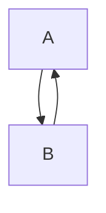

# blog

突发写博客意愿，丢些奇怪的东西在这

- LaTeX语法支持测试

```LaTeX
$$\Huge\LaTeX_{\small(a+b)^2=a^2+2ab+b^2}$$
```

$$\Huge\LaTeX_{\small(a+b)^2=a^2+2ab+b^2}$$

- mermaid流程图支持测试

对这个不熟，官网丢这：<https://mermaid-js.github.io/mermaid/>

```text
	```mermaid
	graph TD;
    	A-->B;
    	B-->A;
	```
```



- cpp语法高亮测试

```cpp
#include<iostream>
int main()
{
	std::cout<<"Hello zerrun!"<<std::endl;
	return 0;
}
```