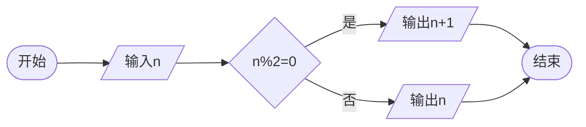

# 样式测试页面

如标题所展示，这是一个样式测试网站，没有任何实际内容

如果你没啥事跑到了这里，欢迎[跑回去](/)

## LaTeX语法支持测试

```LaTeX
$$\Huge\LaTeX_{\small(a+b)^2=a^2+2ab+b^2}$$
```

$$\Huge\LaTeX_{\small(a+b)^2=a^2+2ab+b^2}$$

## mermaid流程图支持测试

对这个不熟，官网丢这：<https://mermaid-js.github.io/mermaid/>

```text
\```mermaid
flowchart LR
start([开始])
stop([结束])
input[/输入n/]
output1[/输出n+1/]
output2[/输出n/]
if{n%2=0}
start-->input-->if
if--是-->output1-->stop
if--否-->output2-->stop
\```
```



## cpp语法高亮测试

```cpp
#include<iostream>
int main()
{
    std::cout<<"Hello zerrun!"<<std::endl;
    return 0;
}
```
