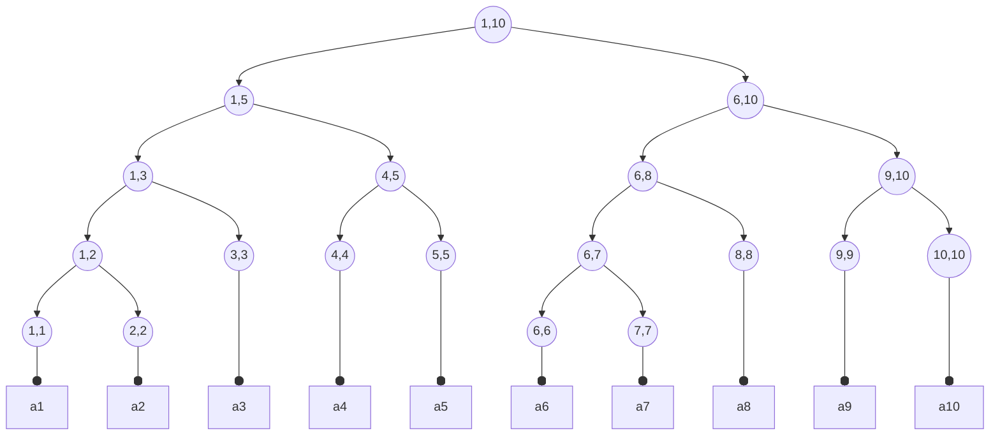

# 1105干事课

第三次干事课，前面两次上课还没开坑，干脆就丢了吧~

## 线段树

线段树是算法竞赛中常用的用来维护**区间信息**的数据结构

线段树可以在$O(log\ n)$的时间复杂度内实现单点修改、区间修改、区间查询(区间求和，求区间最大值，求区间最小值，求区间某个数的个数)等操作



*<center>一棵保存区间端点信息的线段树</center>*

手模占坑

通常情况下，我们使用结构体数组存储信息，结构体开到4n大小是比较合适的，因为p的左儿子是2p(p<<1)，右儿子就是2p+1(p<<1|1)，当然也可以用指针的方式节约空间

以[洛谷P3372](https://www.luogu.com.cn/problem/P3372)为例，一棵线段树需要满足以下要求(类比二叉树理解)

### 树的定义
```cpp
struct Tree
{
	int l, r;//区间左右端点
	long long val, lazy_tag;//求和与懒惰标记
} tree[4 * (int)1e5 + 5];
```

### 建树(Build)
```cpp
void Build(int p/*当前节点下标*/, int l/*操作左端点*/, int r/*操作右端点*/)
{
	tree[p].l = l;
	tree[p].r = r;
	if (l == r)//如果区间左端点等于右端点，则该节点为叶子节点
	{
		tree[p].val = arr[l];
		return;
	}
	int mid = (tree[p].l + tree[p].r) >> 1;
	Build(p << 1, l, mid);//左儿子存左端点到中点
	Build(p << 1 | 1, mid + 1, r);//右儿子存中点到右端点
	tree[p].val = tree[p << 1].val + tree[p << 1 | 1].val;//父亲是儿子的和
}
```

### 下推懒惰标记(PushDown)

> 懒惰标记，简单来说，就是通过延迟对节点信息的更改，从而减少可能不必要的操作次数。每次执行修改时，我们通过打标记的方法表明该节点对应的区间在某一次操作中被更改，但不更新该节点的子节点的信息。实质性的修改则在下一次访问带有标记的节点时才进行。   ——oi wiki

人话：整个区间都要修改，我就先停在这，万一用不上呢？用得上的时候我再改过去

可以说懒惰标记 _(Lazy tag)_ 就是线段树能够大幅降低区间修改时间的利器

```cpp
void PushDown(int p)
{
	if (tree[p].lazy_tag == 0)
		return;//压根没有懒惰标记就回去吧
	if (tree[p].l == tree[p].r)
	{
		tree[p].lazy_tag = 0;
		return;//叶子节点的懒惰标记也没啥用啊
	}
	tree[p << 1].val += (tree[p << 1].r - tree[p << 1].l + 1) * tree[p].lazy_tag;//左儿子区间每个点都加上一个懒惰标记的值
	tree[p << 1 | 1].val += (tree[p << 1 | 1].r - tree[p << 1 | 1].l + 1) * tree[p].lazy_tag;
	tree[p << 1].lazy_tag += tree[p].lazy_tag;//懒惰标记下推
	tree[p << 1 | 1].lazy_tag += tree[p].lazy_tag;
	tree[p].lazy_tag = 0;//自己的懒惰标记已经下推，于是自己的标记就没了
}
```

### 区间修改(Modify)

```cpp
void Modify(int p, int l, int r, int v)
{
	if (tree[p].l <= l && r <= tree[p].r)
	{
		tree[p].val += (r - l + 1) * v;//修改区间在本节点区间内要改
		if (tree[p].l == l && r == tree[p].r)
		{
			tree[p].lazy_tag += v;//本区间全部要改，那就加个懒惰标记，然后不理它了
			return;
		}
	}
	int mid = (tree[p].l + tree[p].r) >> 1;
	if (r <= mid)//修改区间在本节点区间左边
		Modify(p << 1, l, r, v);
	else if (l >= mid + 1)//修改区间在本节点区间右边
		Modify(p << 1 | 1, l, r, v);
	else if (l <= mid && r >= mid + 1)//修改区间跨区了
	{
		Modify(p << 1, l, mid, v);
		Modify(p << 1 | 1, mid + 1, r, v);
	}
}
```

### 区间查询(Query)

```cpp
long long Query(int p, int l, int r)
{
	PushDown(p);//要访问区间了，才下推懒惰标记
	if (l == tree[p].l && tree[p].r == r)
		return tree[p].val;//查询的恰好是本区间
	int mid = (tree[p].l + tree[p].r) >> 1;
	if (r <= mid)//查询区间在本节点区间左边
		return Query(p << 1, l, r);
	else if (l >= mid + 1)//查询区间在本节点区间右边
		return Query(p << 1 | 1, l, r);
	else//查询区间跨区了
		return Query(p << 1, l, mid) + Query(p << 1 | 1, mid + 1, r);
	/*你细品查询和修改的差异*/
}
```

### 完整代码

数据结构的代码就是死长死长的，main函数里就几句话

<details>

**<summary> 点我看完整代码 </summary>**

```cpp
/*
*线段树模板
*luogu P3372
*/
#include <iostream>
struct Tree
{
	int l, r;
	long long val, lazy_tag;
} tree[4 * (int)1e5 + 5];
long long arr[(int)1e5 + 5];
void Build(int p, int l, int r)
{
	tree[p].l = l;
	tree[p].r = r;
	if (l == r)
	{
		tree[p].val = arr[l];
		return;
	}
	int mid = (tree[p].l + tree[p].r) >> 1;
	Build(p << 1, l, mid);
	Build(p << 1 | 1, mid + 1, r);
	tree[p].val = tree[p << 1].val + tree[p << 1 | 1].val;
}
void PushDown(int p)
{
	if (tree[p].lazy_tag == 0)
		return;
	if (tree[p].l == tree[p].r)
	{
		tree[p].lazy_tag = 0;
		return;
	}
	tree[p << 1].val += (tree[p << 1].r - tree[p << 1].l + 1) * tree[p].lazy_tag;
	tree[p << 1 | 1].val += (tree[p << 1 | 1].r - tree[p << 1 | 1].l + 1) * tree[p].lazy_tag;
	tree[p << 1].lazy_tag += tree[p].lazy_tag;
	tree[p << 1 | 1].lazy_tag += tree[p].lazy_tag;
	tree[p].lazy_tag = 0;
}
void Modify(int p, int l, int r, int v)
{
	if (tree[p].l <= l && r <= tree[p].r)
	{
		tree[p].val += (r - l + 1) * v;
		if (tree[p].l == l && r == tree[p].r)
		{
			tree[p].lazy_tag += v;
			return;
		}
	}
	int mid = (tree[p].l + tree[p].r) >> 1;
	if (r <= mid)
		Modify(p << 1, l, r, v);
	else if (l >= mid + 1)
		Modify(p << 1 | 1, l, r, v);
	else if (l <= mid && r >= mid + 1)
	{
		Modify(p << 1, l, mid, v);
		Modify(p << 1 | 1, mid + 1, r, v);
	}
}
long long Query(int p, int l, int r)
{
	PushDown(p);
	if (l == tree[p].l && tree[p].r == r)
		return tree[p].val;
	int mid = (tree[p].l + tree[p].r) >> 1;
	if (r <= mid)
		return Query(p << 1, l, r);
	else if (l >= mid + 1)
		return Query(p << 1 | 1, l, r);
	else
		return Query(p << 1, l, mid) + Query(p << 1 | 1, mid + 1, r);
}
int main()
{
	int n, m, opt, x, y, k;
	std::cin >> n >> m;
	for (int i = 1; i <= n; i++)
		std::cin >> arr[i];
	Build(1, 1, n);
	while (m--)
	{
		std::cin >> opt >> x >> y;
		switch (opt)
		{
		case 1:
			std::cin >> k;
			Modify(1, x, y, k);
			break;
		case 2:
			std::cout << Query(1, x, y) << std::endl;
			break;
		}
	}
	return 0;
}
```

</details>

## 博弈论(占坑)

简单来说，博弈论就是石头剪刀布

机器算法是死的，不能参入人性或是无穷的计算，所以算法中的博弈论特指**公平组合游戏(Impartial Game)**

公平组合游戏的定义如下：

- 游戏有两个人参与，二者轮流做出决策，双方均知道游戏的完整信息

- 任意一个游戏者在某一确定状态可以作出的决策集合只与当前的状态有关，而与游戏者无关

- 游戏中的同一个状态不可能多次抵达，游戏以玩家无法行动为结束，且游戏一定会在有限步后以非平局结束

### Bash游戏

只有一堆n个物品，两个人轮流从这堆物品中取物，规定每次至少取一个，最多取m个，最后取光者胜

$n\%(m+1)=0$后手必胜，否则先手必胜

证明占坑

### Nim游戏

有若干堆石子，每堆石子的数量都是有限的，合法的移动是“选择一堆石子并拿走若干颗（不能不拿）”，如果轮到某个人时所有的石子堆都已经被拿空了，则判负（因为他此刻没有任何合法的移动）

做法：求各堆石子的异或和

${XOR}^{i=n}_{i=1}a_n=0$则先手必败

[洛谷P2197](https://www.luogu.com.cn/problem/P2197)

证明占坑

### 阶梯博弈

有若干个石子随意分布在一根轴上，轴的左端不能移动，游戏者可以操作石子从右向左移动大于0的距离，但不能越过已经存在石子的坐标，当轮到某个人无法操作了，则判负

石子组队，之间距离记作nim游戏中一堆石子的数量，问题转换位nim游戏

图占坑

### 威佐夫博弈

有两堆各若干个物品，两个人轮流从任一堆取至少一个或同时从两堆中取同样多的物品，规定每次至少取一个，多者不限，最后取光者得胜

当且仅当$\lfloor(y-x)*\frac{\sqrt{5}+1}{2}\rfloor=x (x<y)$ 时先手必败

[洛谷P2252](https://www.luogu.com.cn/problem/P2252)

证明摸了

## 放球问题

```
pdf画的太乱了就不发了（
本次涉及的题 博客
oiwiki 数学 博弈论
poj2975
poj1067
poj2484
poj1704
poj2068
luogu P2574
组合数 放球问题
https://blog.csdn.net/my_sunshine26/article/details/77385809?utm_source=app&app_version=4.15.0&code=app_1562916241&uLinkId=usr1mkqgl919blen

```

{docsify-updated}