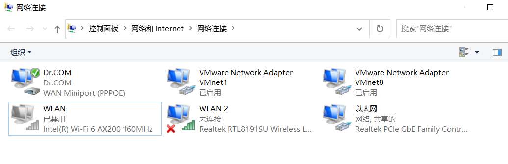
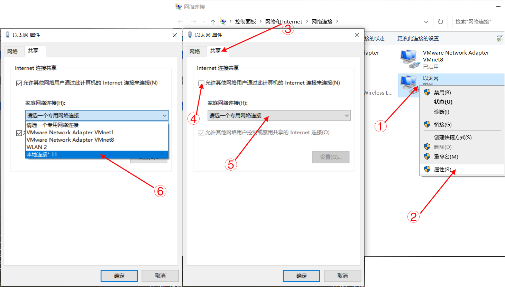

# 校园网热点

## 简介

类似GDUT使用的校园网Dr.com需要电脑插网线进行拨号上网，这导致电脑不能直接打开热点给手机连

网上存在一种解决方案思路是先手机给电脑开热点，骗电脑开热点，再手机连电脑热点，操作麻烦

我搜寻了一下，找到一个可以通过命令行直接开热点的方式，步骤和命令丢下面

## 步骤

使用环境：

redmi G 2021 AMD

windows 10 19043

Intel(R) Wi-Fi 6 AX200 160MHz

Realtek RTL8191SU 无线 LAN 802.11n USB 2.0 网络适配器

### 1. 环境检查

右键开始菜单或者`win+X`，以管理员模式打开power shell(或者其他任何终端)

输入`netsh wlan show drivers`

返回如下

```power shell
PS C:\Windows\system32> netsh wlan show drivers

接口名称: WLAN

    驱动程序                  : Intel(R) Wi-Fi 6 AX200 160MHz
    供应商                    : Intel Corporation
    提供程序                  : Intel
    日期                      : 2021/4/19
    版本                      : 22.50.0.7
    INF 文件                  : oem13.inf
    类型                      : 本机 WLAN 驱动程序
    支持的无线电类型          : 802.11b 802.11g 802.11n 802.11a 802.11ac 802.11ax
    支持 FIPS 140-2 模式: 是
    支持 802.11w 管理帧保护 : 是
    支持的承载网络  : 否          <--------------------注意这行
    基础结构模式中支持的身份验证和密码:
                                开放式             无
                                开放式             WEP-40bit
                                开放式             WEP-104 位
                                开放式             WEP
                                WPA - 企业        TKIP
                                WPA - 企业        CCMP
                                WPA - 个人        TKIP
                                WPA - 个人        CCMP
                                WPA2 - 企业       TKIP
                                WPA2 - 企业       CCMP
                                WPA2 - 个人       TKIP
                                WPA2 - 个人       CCMP
                                开放式             供应商定义的
                                WPA3 - 个人       CCMP
                                供应商定义的          供应商定义的
                                WPA3 - 企业       GCMP-256
                                OWE             CCMP
    是否存在 IHV 服务         : 是
    IHV 适配器 OUI            : [00 00 00]，类型: [00]
    IHV 扩展 DLL 路径         : C:\Windows\system32\IntelIHVRouter08.dll
    IHV UI 扩展 ClSID         : {00000000-0000-0000-0000-000000000000}
    IHV 诊断 CLSID            : {00000000-0000-0000-0000-000000000000}
    支持的无线显示器: 是 (图形驱动程序: 是，WLAN 驱动程序: 是)
```

好的，非常可惜，我电脑内置的Intel网卡不支持开热点呢 ~~教程结束~~

如果你的网卡支持承载网络，那么你可以跳转到[下一步](#_2-配置你的热点共享你的网络)了

如果不行，可以尝试和我一样再插一张无线网卡进去

```power shell
PS C:\Windows\system32> netsh wlan show drivers

接口名称: WLAN

    驱动程序                  : Intel(R) Wi-Fi 6 AX200 160MHz
    供应商                    : Intel Corporation
    提供程序                  : Intel
    日期                      : 2021/4/19
    版本                      : 22.50.0.7
    INF 文件                  : oem13.inf
    类型                      : 本机 WLAN 驱动程序
    支持的无线电类型          : 802.11b 802.11g 802.11n 802.11a 802.11ac 802.11ax
    支持 FIPS 140-2 模式: 是
    支持 802.11w 管理帧保护 : 是
    支持的承载网络  : 否
    基础结构模式中支持的身份验证和密码:
                                开放式             无
                                开放式             WEP-40bit
                                开放式             WEP-104 位
                                开放式             WEP
                                WPA - 企业        TKIP
                                WPA - 企业        CCMP
                                WPA - 个人        TKIP
                                WPA - 个人        CCMP
                                WPA2 - 企业       TKIP
                                WPA2 - 企业       CCMP
                                WPA2 - 个人       TKIP
                                WPA2 - 个人       CCMP
                                开放式             供应商定义的
                                WPA3 - 个人       CCMP
                                供应商定义的          供应商定义的
                                WPA3 - 企业       GCMP-256
                                OWE             CCMP
    是否存在 IHV 服务         : 是
    IHV 适配器 OUI            : [00 00 00]，类型: [00]
    IHV 扩展 DLL 路径         : C:\Windows\system32\IntelIHVRouter08.dll
    IHV UI 扩展 ClSID         : {00000000-0000-0000-0000-000000000000}
    IHV 诊断 CLSID            : {00000000-0000-0000-0000-000000000000}

接口名称: WLAN 2

    驱动程序                  : Realtek RTL8191SU 无线 LAN 802.11n USB 2.0 网络适配器
    供应商                    : Realtek Semiconductor Corp.
    提供程序                  : Microsoft
    日期                      : 2013/3/30
    版本                      : 1086.51.328.2013
    INF 文件                  : net8192su64.inf
    类型                      : 本机 WLAN 驱动程序
    支持的无线电类型          : 802.11n 802.11g 802.11b
    支持 FIPS 140-2 模式: 否
    支持 802.11w 管理帧保护 : 否
    支持的承载网络  : 是
    基础结构模式中支持的身份验证和密码:
                                开放式             无
                                WPA2 - 个人       CCMP
                                开放式             WEP-40bit
                                开放式             WEP-104 位
                                开放式             WEP
                                WPA - 企业        TKIP
                                WPA - 个人        TKIP
                                WPA2 - 企业       TKIP
                                WPA2 - 个人       TKIP
                                WPA - 企业        CCMP
                                WPA - 个人        CCMP
                                WPA2 - 企业       CCMP
                                供应商定义的          TKIP
                                供应商定义的          CCMP
    临时模式中支持的身份验证和密码:
                                开放式             无
                                开放式             WEP-40bit
                                开放式             WEP-104 位
                                开放式             WEP
                                WPA2 - 个人       CCMP
    支持的无线显示器: 是 (图形驱动程序: 是，WLAN 驱动程序: 是)
```

可以看到接口 `WLAN 2`支持承载网络

然后，你需要在`网络和Internet设置`>`更改适配器选项`处，禁用不支持承载网络的网卡



### 2. 配置你的热点/共享你的网络

刚才的power shell(终端)窗口还没关吧，关了就再打开一次，记得以管理员身份

输入`netsh wlan set hostednetwork mode=allow ssid=zerrunblog key=1145141919810`

这里有几个参数可以自己改`ssid`(wifi名字)和`key`(wifi密码)

```power shell
PS C:\Windows\system32> netsh wlan set hostednetwork mode=allow ssid=zerrunblog key=1145141919810
承载网络模式已设置为允许。
已成功更改承载网络的 SSID。
已成功更改托管网络的用户密钥密码。
```

输入`netsh wlan start hostednetwork`

```power shell
PS C:\Windows\system32> netsh wlan start hostednetwork
已启动承载网络。
```

然后在`网络和Internet设置`>`更改适配器选项`处，多了一个叫**本地连接**,下面还有**Microsoft Hosted Network Virtual Adapter**的灰字，那就是我们的虚拟热点网卡了



① 找到自己正常上网的网卡 *(一般都是以太网)*

② 右键属性

③ 点击**共享**选项页

④ 勾选

⑤⑥ 点开下拉栏，选择刚才多出来的本地连接

好了，现在拿出手机连上自己的热点，应该就有网了

> 经过测试，这种方式开的热点好像没有设备限制

### 3. 关闭热点

power shell(终端)里输入`netsh wlan stop hostednetwork`

```power shell
PS C:\Windows\system32> netsh wlan stop hostednetwork
已停止承载网络。
```

{docsify-updated}
