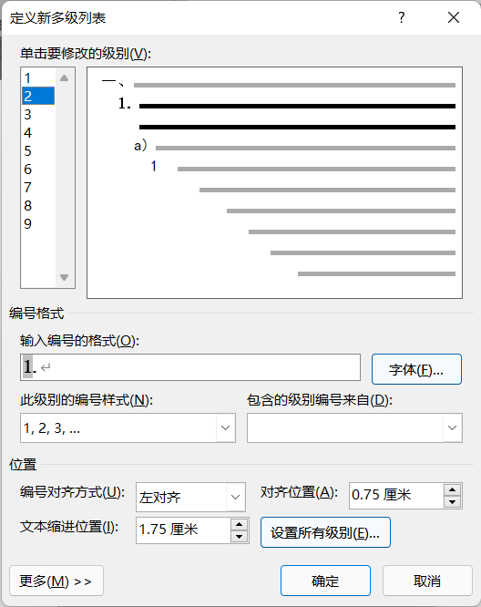
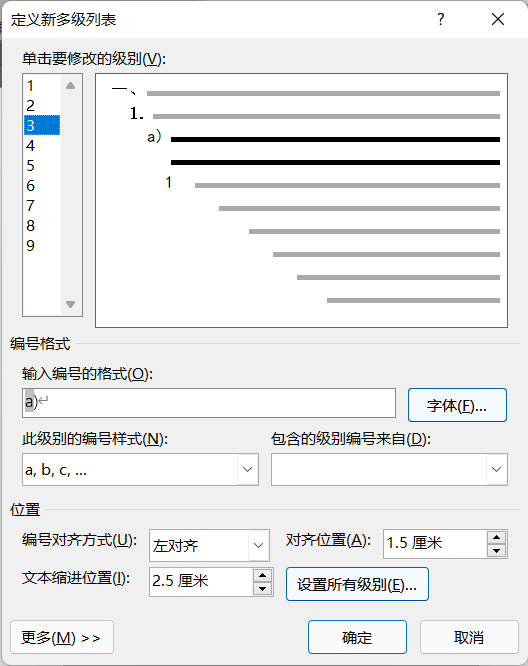
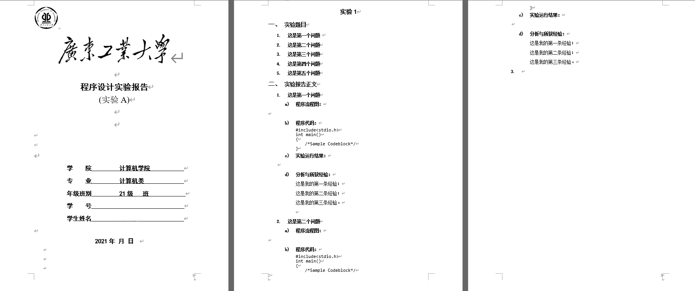

# 程序设计报告 (上)

众所周知，比起word，markdown更适合用于写程序设计报告之类的东西，但是学校要求使用word写文档，遂开新坑，用优雅的方式在word上写程序设计报告

关于在word上写程序报告，网上做法很多，但不是很适合我的需求，摸索了两篇报告，对word写程序报告有了一点眉目，靠这个坑记录自己的经验

程序报告共分成三个方面：

1. 格式排版

2. 代码块

3. 流程图

本文将会先介绍如何优雅地进行格式排版与代码的插入

> 使用软件：Microsoft Word 2019、Microsoft Excel 2019

## 格式排版

主体参照程序设计老师给的[模板文档](https://www.scholat.com/course/V_courseResourceDownload.html?courseId=3147&resourceId=52393)(学者网登录后可下载)，但是模板文档不能直接拿来用，因为里面对分级编号、页边距、代码的处理实在太烂，除了封面照抄，剩下内容爆改(只提及修改内容，未提及内容参照模板文件)

### 新建word文件

请使用符合时代的.docx文件 ~~*(模板文档第一刀，文件格式老)*~~

在开始之前，确认你的页边距统一为“常规”(布局>页边距) ~~*(模板文档第二刀，页边距不统一)*~~

### 封面

不会有人不知道word可以带格式复制粘贴吧

### 分级编号

文档结构：

```text
封面
实验内容
├──实验题目
│  ├──问题描述1
│  │  ...
│  └──问题描述n
└──实验报告正文
   ├──问题1
   │  ├──程序流程图
   │  ├──程序代码
   │  ├──实验允许结果
   │  └──分析与所获经验
   │  ...
   └──问题n
```

可以看见明显的分级结构，所以分级编号是我们要大改的地方 ~~*(模板文档第三刀，分级编号混乱)*~~

`开始>多级列表>定义新的多级列表`

只用得上三级，照着改





然后记得多分段，不同的等级可以靠Tab缩进次数或者手动点选`开始>多级列表>更改列表级别`区分

### 代码块

这里介绍一个简单点的处理方式，后文会有更好的展示方案

字体选择Consolas 小四

`段落>行距`取固定值12磅

记得把它分级列表给关了

因为分级列表会通过Tab识别等级，所以我们不能使用分级列表给代码标行号，稍后使用另外一种方法

### 最终效果



## 代码插入

坑

{docsify-updated}
