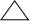

# GDUT21计算机智慧树答案

## 绪论 单元测试

1、单选题：

以下对C语言程序的描述，正确的是（ ）。

A:C语言程序首先执行main函数前的语句

B:C语言程序从定义的第一个函数开始执行

C:C语言程序总是从main函数开始执行

D:C语言程序从包含的第一个头文件开始执行

答案: 【C语言程序总是从main函数开始执行】

2、单选题：

C语言属于（ ）语言。

A:面对对象语言

B:高级语言

C:机器语言

D:汇编语言

答案: 【高级语言】

3、单选题：

以下对C语言程序工作过程的描述，错误的是（ ）。

A:程序中的指令、数据均以二进制形式存储在存储器中

B:程序编译链接为可执行文件后存储在磁盘中

C:执行程序时通过解释器，逐行边解释为机器可理解的指令边执行这些指令

D:程序执行时将按照程序指定的逻辑从存储器中获取指令，并逐条执行

答案: 【执行程序时通过解释器，逐行边解释为机器可理解的指令边执行这些指令】

4、单选题：

以下关于计算机语言的描述，错误的是（ ）。

A:计算机高级语言（如C语言）更具有可读性，开发效率进一步提升

B:计算机可以直接使用机器语言

C:汇编语言中使用了助记符来帮助开发人员开发

D:计算机可以不需要解析直接使用高级语言

答案: 【计算机可以不需要解析直接使用高级语言】

5、多选题：

C语言的功能和用途有（ ）。

A:编写嵌入式系统

B:直接与硬件交互

C:编写操作系统底层调度算法

D:开发其他计算机高级语言

答案: 【编写嵌入式系统;直接与硬件交互;编写操作系统底层调度算法;开发其他计算机高级语言】

6、多选题：

C语言程序中包含（ ）。

A:main函数

B:助记符

C:头文件

D:定义的变量

答案: 【main函数;助记符;头文件;定义的变量】

7、判断题：

C语言程序中可以没有main函数，也可以执行。（ ）

A:对

B:错

答案: 【错】

## 第一章 单元测试

1、单选题：

以下不是算法的特征是（ ）

A:确切性

B:简洁性

C:可行性

D:有穷性

答案: 【简洁性】

2、单选题：

以下不是评价一个算法的指标（ ）

A:健壮性

B:问题的规模

C:空间复杂度

D:时间复杂度

答案: 【问题的规模】

3、单选题：

以下哪种图形表示选择结构（ ）

A:

B:

C:

D:

答案: 【】

4、单选题：

变量n初始为1，以下代码中哪个n最终可以为10（ ）

A:while(int i=10; i＞=0; i--){n=n\*i}

B:while(int i=0; i＜=10; i++){n=n\*i}

C:while(n＜10){n=n+1;}

D:while(n＜=10){n=n+1}

答案: 【while(n＜=10){n=n+1}】

5、单选题：

实现x和y的值交换，能够实现此功能的是（ ）

A:x=y; y=x; x=x;

B:int t; t=x; x=y; y=t;

C:x=y; y=x;

D:x=y;

答案: 【int t; t=x; x=y; y=t;】

6、单选题：

结构程序化设计不应该使用（ ）

A:模块化设计

B:灵活、简洁的goto结构

C:自顶向下，逐步细化的方法

D:三种基本结构：顺序结构、选择结构、循环结构的编码方法

答案: 【自顶向下，逐步细化的方法】

7、多选题：

程序的基本结构包括（ ）

A:循环结构

B:顺序结构

C:逻辑结构

D:选择结构

答案: 【循环结构;顺序结构;选择结构】

8、多选题：

结构化程序设计方法包括（ ）

A:模块化设计

B:逐步细化

C:结构化编码

D:自顶向下

答案: 【模块化设计;逐步细化;结构化编码;自顶向下】

9、判断题：

算法有且只有一个输入和输出（ ）

A:错

B:对

答案: 【错】

10、判断题：

描述算法可用自然语言、传统流程图、N-S流程图来描述（ ）

A:对

B:错

答案: 【对】

## 第二章 单元测试

1、单选题：

下列定义变量的语句中错误的是：（ ）

A:float US\$_

B:double int

C:int _int123

D:char For

答案: 【float US\$_】

2、单选题：

C语言中最简单的数据类型包括：（ ）

A:整型、实型、逻辑型、字符型

B:整型、实型、逻辑型

C:整型、字符型、逻辑型

D:整型、实型、字符型

答案: 【整型、实型、字符型】

3、单选题：

main(){int a=8,b=4;printf("%dn", b=b/a);}上述程序的输出结果是（ ）

A:1

B:0

C:4

D:不确定值

答案: 【0】

4、单选题：

a=125.534;a=(int)125.521%4;设a为int型变量，执行上述赋值语句后，a的取值分别是（ ）

A:125.534,2

B:125,21

C:125,1

D:125,31

答案: 【125,1】

5、单选题：

int b=3; ++b;则b的值为（ ）

A:5

B:3

C:4

D:2

答案: 【4】

6、单选题：

下列说法不正确的是（ ）

A:在一个函数内部,可以在复合语句中定义变量，这些变量只在本复合语句中有效

B:不同函数中,可以使用相同名字的变量

C:形式参数是局部变量

D:主函数main中定义的变量在整个文件或程序中有效

答案: 【主函数main中定义的变量在整个文件或程序中有效】

7、多选题：

以下属于不合法赋值语句的是（ ）

A:x=y=200;

B:x+y;

C:c=int(a+b);

D:--d;

答案: 【x=y=200;;x+y;;c=int(a+b);】

8、多选题：

以下选项是不合法常量的是（ ）

A:23.2e11.2

B:D

C:"girl"

D:'10'

答案: 【23.2e11.2;D】

9、判断题：

￥temp是合法的变量名称（ ）

A:错

B:对

答案: 【错】

10、判断题：

编译系统把浮点型常量都按双精度处理，分配16个字节（ ）

A:错

B:对

答案: 【错】

## 第三章 单元测试

1、单选题：

main() {int a=1, b=2, c=3;if(a＜c) {b=a;c=b;a=c;} else {a=0;}printf("a=%d", a);}上述程序的输出是（ ）

A:1

B:3

C:0

D:2

答案: 【1】

2、单选题：

以下一组运算符中，优先级最低的运算符是（ ）

A:\*

B:＞

C:!=

D:-

答案: 【!=】

3、单选题：

\#include＜stdio.h＞int main(){ int a=1,b=2,c=3,d=4,m=2,n=2; (m=a＜b)||(n=c＞d); printf("%dt%d",m,n); return 0;}上述程序的输出为：（ ）

A:1 0

B:1 2

C:2 2

D:0 1

答案: 【1 2】

4、单选题：

若int i=0,j=1,k=2 k= i++ && j++;则此时的k为多少（ ）

A:2

B:1

C:3

D:0

答案: 【0】

5、单选题：

设a=1,b=2,c=3,d=4,则表达式:a＞b?a:c＜d?c:d的结果为（ ）

A:1

B:4

C:2

D:3

答案: 【3】

6、单选题：

以下不能作为switch语句中的条件的是（ ）

A:1+1

B:3.14

C:'A'

D:1

答案: 【1+1】

7、多选题：

以下 if 语句形式正确的有（ ）

A:if(表达式)｛若干语句;｝else if｛若干语句;｝

B:if(表达式)｛若干语句;｝

C:if(表达式)｛若干语句;｝else｛若干语句;｝

D:if(表达式)｛若干语句;｝if ｛若干语句;｝else｛若干语句;｝

答案: 【if(表达式)｛若干语句;｝else if｛若干语句;｝;if(表达式)｛若干语句;｝;if(表达式)｛若干语句;｝else｛若干语句;｝;if(表达式)｛若干语句;｝if ｛若干语句;｝else｛若干语句;｝】

8、多选题：

以下对逻辑运算符两侧的运算对象的数据类型描述不正确的是（ ）

A:只能是0或非0整数

B:可以是整数或字符型数据

C:只能是0或者1

D:可以是任何类型的整数

答案: 【只能是0或非0整数;只能是0或者1;可以是任何类型的整数】

9、判断题：

条件运算符?和:是一对运算符，不能分开单独使用。（ ）

A:对

B:错

答案: 【对】

10、判断题：

在switch语句中，每一个的case常量表达式的值可以相同。（ ）

A:错

B:对

答案: 【错】

## 第四章 单元测试

1、单选题：

下面有关for循环的正确描述有（ ）

A:for循环是先执行循环体语句，后判定表达式

B:for循环语句中，可以包含多条语句，但要用花括号括起来

C:在for循环中，不能用break语句跳出循环体

D:for循环只能用于循环次数已经确定的情况

答案: 【在for循环中，不能用break语句跳出循环体】

2、单选题：

以下叙述正确的是（ ）

A:只能在循环体内和switch语句体内使用break语句

B:从多层循环嵌套中退出时，只能使用goto语句

C:在循环体内使用break语句或continue语句作用相同

D:continue语句的作用是结束整个循环的执行

答案: 【只能在循环体内和switch语句体内使用break语句】

3、单选题：

int k=0;while(k=0) k=k-1;对上述程序段叙述正确的是（ ）

A:循环体一次也不执行

B:while循环执行10次

C:循环体被执行

D:无限循环

答案: 【循环体一次也不执行】

4、单选题：

for(i=3;i;i--)for(j=0;j＜2;j++)for(k=0;k＜=2;k++){......}若i,j已定义成int型，则上述程序段中内循环体的总执行次数是（ ）

A:18

B:36

C:30

D:27

答案: 【18】

5、单选题：

int a=10,b=0;do{b+=2;a-=2+b;}while(a＞=0);上述程序段中,循环体的执行次数是（ ）

A:5

B:3

C:2

D:4

答案: 【3】

6、单选题：

main(){for(int i=1;i＜=5;i++){if(i%2) printf("\*");else continue;printf("#");}printf("$n");}上述程序的输出结果是（ ）

A:\*#\*#\*#\$

B:#\*#\*\$

C:\*#\*#\$

D:#\*#\*#\*\$

答案: 【\*#\*#\*#\$】

7、多选题：

在C语言中，以下说法错误的是（ ）

A:不能使用do-while构成循环

B:do-while构成的循环，当while中的表达式值为非零时结束循环

C:do-while构成的循环必须用break才能退出

D:do-while构成的循环，当while中的表达式值为零时结束循环

答案: 【不能使用do-while构成循环;do-while构成的循环，当while中的表达式值为非零时结束循环;do-while构成的循环必须用break才能退出】

8、多选题：

for(t=1;t＜=100;t++){scanf("%d",&x);if(x＜0) continue;printf("%dn",t);}对上述程序段，描述错误的是（ ）

A:当x＞=0时，什么也不输出

B:最多允许输出100个非负整数

C:printf函数永远也不执行

D:当x＜0时，整个循环结束

答案: 【当x＞=0时，什么也不输出;printf函数永远也不执行;当x＜0时，整个循环结束】

9、判断题：

do-while语句构成的循环不能用其他语句构成的循环来代替。（ ）

A:对

B:错

答案: 【错】

10、判断题：

while的循环控制条件比do-while的循环控制条件严格。（ ）

A:错

B:对

答案: 【错】

## 第五章 单元测试

1、单选题：

int a[12]={1,2,3,4,5,6,7,8,9,10,11,12}; 若有上述数组说明，则数值最大的和最小的元素下标分别是（ ）

A:0,11

B:1,12

C:0,12

D:1,11

答案: 【0,11】

2、单选题：

int a[12]={1,4,7,10,2,5,8,11,3,6,9,12};若有上述数组说明，则int i=10; a[a[i]]元素数值是（ ）

A:5

B:10

C:9

D:6

答案: 【6】

3、单选题：

假定int类型变量占用两个字节，其有定义int x[10]={0,2,4};，则数组x在内存中所占字节数是（ ）

A:6

B:10

C:3

D:20

答案: 【20】

4、单选题：

若有说明：int a[][3]={{1,2,3},{4,5},{6,7}}; 则数组a的第一维的大小为（ ）

A:5

B:3

C:4

D:2

答案: 【3】

5、单选题：

以下定义语句中，错误的是（ ）

A:int a[]={1,2};

B:char s[10]=“test”;

C:char a[5]={0};

D:int n=5, a[n];

答案: 【int n=5, a[n];】

6、单选题：

int x[3][3]={1,2,3,4,5,6,7,8,9};for (int i=0;i＜3;i++) printf("%d",x[i][2-i]);上述程序段的输出结果是：（ ）

A:1 5 9

B:1 4 7

C:3 6 9

D:3 5 7

答案: 【3 5 7】

7、多选题：

下面初始化正确的是（ ）

A:char arr4[3] = {'a',98, 'c'};

B:int arr2[] = {1,2,3,4};

C:int arr1[10] = {1,2,3};

D:int arr3[5] = {1,2,3,4,5};

答案: 【char arr4[3] = {'a',98, 'c'};;int arr2[] = {1,2,3,4};;int arr1[10] = {1,2,3};;int arr3[5] = {1,2,3,4,5};】

8、多选题：

下面二维数组初始化正确的是（ ）

A:int arr[3][4] = {{1,2},{4,5}};

B:int arr[][4] = {{2,3},{4,5}};

C:int arr[3][4] = {{1,2,3,4}};

D:int arr[3][] = {1,2,3,4};

答案: 【int arr[3][4] = {{1,2},{4,5}};;int arr[][4] = {{2,3},{4,5}};;int arr[3][4] = {{1,2,3,4}};】

9、判断题：

字符串比较的规则是: 将两个字符串自左至右逐个字符相比(按ASCII码值大小比较)，直到出现不同的字符或遇到′′为止。（ ）

A:对

B:错

答案: 【对】

10、判断题：

scanf函数中的输入项如果是字符数组名，不需要再加地址符&。（ ）

A:错

B:对

答案: 【对】

## 第六章 单元测试

1、单选题：

未指定存储类别的变量，其默认的隐含存储类别为（ ）。

A:register

B:static

C:extern

D:auto

答案: 【auto】

2、单选题：

将数组名作为函数调用时的实参时，传递给形参的是（ ）。

A:数组的首地址

B:数组的第一个元素

C:数组所有元素

D:数组元素的个数

答案: 【数组的首地址】

3、单选题：

对C语言中函数的描述正确的是（ ）。

A:可以嵌套调用，不可以递归调用

B:可以嵌套定义

C:嵌套调用和递归调用均可以

D:可以递归调用和嵌套调用要看

答案: 【嵌套调用和递归调用均可以】

4、单选题：

C语言在函数调用时，以下说法正确的是（ ）。

A:实参数量可以多于形参数量

B:形参在函数调用后仍然在内存中，直到程序运行结束才释放空间

C:形参可以不指定具体的类型，由实参确定类型

D:实参和形参的类型需要保持一致

答案: 【实参和形参的类型需要保持一致】

5、单选题：

以下对C语言函数的返回值说法中，正确的是（ ）。

A:返回值类型可以临时确定

B:返回值类型由函数定义的类型决定

C:函数中不能有多个return语句

D:对于void函数，函数中可以出现return

答案: 【返回值类型由函数定义的类型决定】

6、单选题：

当数组名作为函数参数传递时，下面说法正确的是（ ）。

A:形参接收到的是数组的第一个元素值

B:形参可以不指定大小

C:形参不是地址变量

D:形参必须指定大小，否则会溢出的情况

答案: 【形参可以不指定大小】

7、多选题：

以下对C语言函数的理解正确的有（ ）

A:C语言函数定义和调用的越多，运行时间开销呈指数型增长

B:C语言是过程性语言，使用函数可以增强可读性和维护性

C:C语言的执行总是从main函数开始的，且一定在main函数中结束

D:C语言函数的使用可以模块化各个功能组件，方便调用

答案: 【C语言是过程性语言，使用函数可以增强可读性和维护性;C语言的执行总是从main函数开始的，且一定在main函数中结束;C语言函数的使用可以模块化各个功能组件，方便调用】

8、多选题：

以下对C语言存储方式的描述正确的有（ ）。

A:全局变量在程序执行过程中是静态分配和释放的

B:函数形式参数存储在动态存储区，在调用函数前提前分配空间

C:全局变量全部存放在静态存储区中

D:由于编译器可以预先知道函数的执行流程，局部变量可以提前存在静态存储区中

答案: 【全局变量在程序执行过程中是静态分配和释放的;全局变量全部存放在静态存储区中】

9、判断题：

在函数内定义的变量是局部变量，只在函数内有效，在函数外定义的变量是全局变量。（ ）

A:对

B:错

答案: 【对】

10、判断题：

在不同函数中，可以定义具有相同名称的临时变量。（ ）

A:对

B:错

答案: 【对】

## 第七章 单元测试

1、单选题：

一个变量的指针，指的是该变量的（ ）

A:助记符

B:变量名

C:值

D:地址

答案: 【地址】

2、单选题：

int a=2, \*p=&a; 则下列函数调用中错误的是（ ）

A:printf(“%d”, p);

B:printf(“%d”, a);

C:scanf(“%d”, &a);

D:scanf(“%d”, p);

答案: 【printf(“%d”, p);】

3、单选题：

int \*p, a=10, b=1; p=&a; a=\*p+b;执行该段程序结束后，a的值为（ ）

A:11

B:12

C:编译出错

D:10

答案: 【11】

4、单选题：

以下语句中，对字符串操作正确的语句是（ ）

A:char s[5]={“ABCDE”};

B:char \*s=”ABCDE”;

C:char s[5]={‘a’,’b’,’c’,’d’,’e’,’’};

D:char \*s; scanf(“%s”, &s);

答案: 【char \*s=”ABCDE”;】

5、单选题：

int a[5]={1,2,3,4,5}; int \*p=&a[2];则下面对p的操作错误的是（ ）

A:p-1

B:++p

C:int \*q=a; q=q+p;

D:p+1

答案: 【int \*q=a; q=q+p;】

6、单选题：

void fun(int \*p1, int \*p2) {int p; p=\*p1; \*p1=\*p2; \*p2=p;}该段函数的作用为（ ）

A:交换\*p1和\*p2的地址

B:交换\*p1和\*p2的值

C:语法正确，但无法交换\*p1和\*p2的值

D:语法错误

答案: 【交换\*p1和\*p2的值】

7、多选题：

char \*p1 = “Hello,word!”; char p2[] = “Hello,world!”;对p1和p2的描述错误的有（ ）

A:p1是指针指向字符串，所以sizeof(p1)=13

B:p1由于是字符指针变量，所以sizeof(p1)=4

C:p2没有包含结束标志符’\0’

D:p2是字符数组，sizeof(p2)=13

答案: 【p1是指针指向字符串，所以sizeof(p1)=13;p2没有包含结束标志符’\0’】

8、多选题：

以下指针变量定义和引用正确的有（ ）

A:int \*p=&i, i;

B:int i=5; void \*p=&i;

C:int \*p, i;

D:int i, \*p=&i;

答案: 【int \*p, i;;int i, \*p=&i;】

9、判断题：

指针可以实现对数据的间接访问。（ ）

A:错

B:对

答案: 【对】

10、判断题：

指针的类型可以不跟其所指向的变量的数据类型一致。（ ）

A:错

B:对

答案: 【错】

